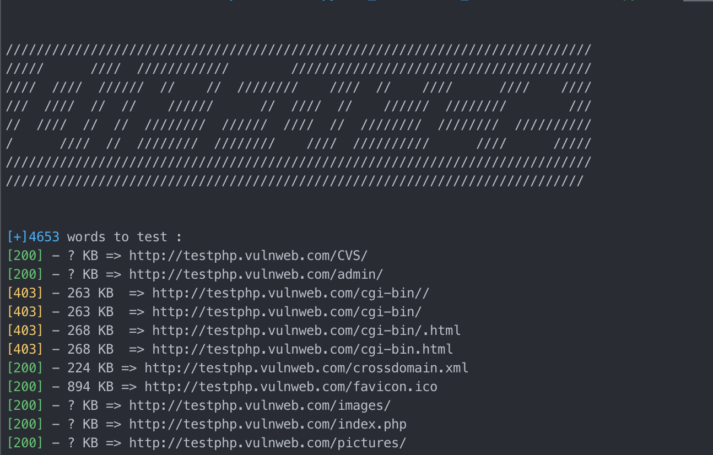
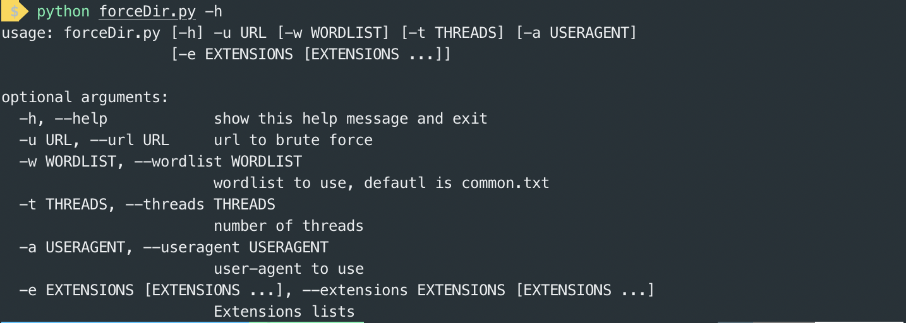

# Python tools

---------

## ForceDir

Simple directory brute forcer written in python using multithreading.



#### Basic use

```bash
python3 forceDir.py -u http://testphp.vulnweb.com
```

**Note**: argument `-u`is required.

#### Options availaible

